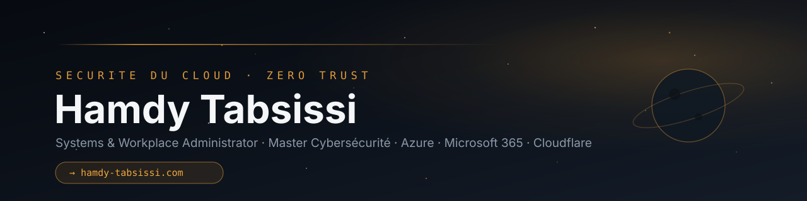

# Hamdy Tabsissi

**IT Support Officer — Action contre la Faim** · en évolution vers **Systems & Workplace Administrator**
Master Cybersécurité (SUP DE VINCI) · Microsoft 365 · Azure · automatisation

Je transforme des besoins en systèmes utiles : je comprends comment les gens travaillent, je conçois la solution, puis je la construis, l'automatise et l'explique. J'exploite en conditions réelles une petite infrastructure personnelle depuis août 2026, et je documente surtout ce qui casse.

### **[→ hamdy-tabsissi.com](https://hamdy-tabsissi.com)** · [LinkedIn](https://www.linkedin.com/in/hamdy-tabsissi/)

---

## Trois projets signature

| Projet | Ce que c'est | Preuve |
|---|---|---|
| **[EventMap](https://github.com/flemops/eventmap)** — *production* | Agrégateur d'événements culturels : ingestion polie de sources ouvertes, déduplication réversible, santé stricte, déploiement conditionné par une CI | [Démo en ligne](https://eventmap.hamdy-tabsissi.com) · tests, CI, journal de décisions et d'incidents dans le dépôt |
| **[Alim'confiance Archive](https://github.com/flemops/alimconfiance-archive)** — *production* | Archive hebdomadaire versionnée d'un jeu de données officiel que l'État ne publie que sur 12 mois glissants | Un snapshot par semaine depuis le 16/08/2026, exécutions publiques, procédure de vérification |
| **[ci-templates](https://github.com/flemops/ci-templates)** — *DevOps* | Workflow GitHub Actions réutilisable et script de déploiement pull-based avec retour arrière automatique, utilisés par 4 applications | Versionné par release, actions épinglées par SHA, utilisé par EventMap (exécutions publiques) |

Aussi public : **[Mindmap](https://github.com/flemops/mindmap)** (carte mentale 3D en Three.js, [démo](https://mindmap.hamdy-tabsissi.com)).

## Infrastructure — ce qui est en place

Une machine virtuelle Oracle (ARM, Ubuntu) derrière Cloudflare, qui héberge le portfolio, EventMap et quelques outils.

- **Accès** : services en écoute locale derrière nginx ; zones d'administration derrière Cloudflare Access ; SSH par clé uniquement (mot de passe désactivé), fail2ban.
- **Déploiement** : pull-based — GitHub valide et déplace un tag, la machine vient le chercher ; healthcheck, retour arrière automatique et mise en quarantaine du commit fautif. GitHub ne détient aucun identifiant d'accès à la machine.
- **Sauvegardes** : réplication SQLite continue et sauvegardes chiffrées hors-site, restauration testée.
- **Supervision** : Uptime Kuma, sondes planifiées GitHub Actions pour EventMap, alertes Telegram via n8n auto-hébergé.
- **Gouvernance** : démarche SMSI de type ISO 27001 documentée (analyse de risques EBIOS RM, déclaration d'applicabilité) — démarche personnelle, **non certifiée** ; mesure d'audience auto-hébergée et anonymisée.

## Académique (cadre : cursus SUPDEVINCI)

Des travaux de cursus, présentés comme tels, avec contribution et limites dans chaque dépôt : **[Cloud hybride](https://github.com/flemops/Projet-Cloud-Hybrid)** (Active Directory et messagerie, dont ma part personnelle ; cas fictif), [SIEM](https://github.com/flemops/Projet-SIEM), [SOC](https://github.com/flemops/Projet-SOC), [Root-Me](https://github.com/flemops/Projet-Root-Me) (exercice contrôlé). Ils n'ont pas valeur d'expérience professionnelle.

## Labs, outils tiers, archives, privé

- **Lab** : [alpaca-lab](https://github.com/flemops/alpaca-lab) — backtest et paper trading uniquement, aucun conseil financier.
- **Fork tiers** : [mission-control](https://github.com/flemops/mission-control) — fork de `builderz-labs/mission-control`, utilisé tel quel, aucun commit personnel.
- **Archivé** : [trier-mes-mails](https://github.com/flemops/trier-mes-mails) — script Gmail abandonné.
- **Privé volontairement** : le portfolio (accès nominatif), Observatory (supervision), les documents internes du SMSI et un espace de travail personnel.

Carte complète des 16 dépôts et de leur statut : [docs/CARTE-DES-DEPOTS.md](docs/CARTE-DES-DEPOTS.md).

## Trois leçons d'exploitation

| Ce qui s'est passé | Ce que j'en retiens |
|---|---|
| Un script de déploiement écrasait la configuration nginx durcie : le site répondait 200, les en-têtes de sécurité avaient disparu | Un healthcheck qui répond 200 ne dit pas que tout va bien : vérifier ce qui compte |
| Une collecte de données échouait en silence depuis des semaines | L'absence d'erreur n'est pas un signe de bonne santé : surveiller la fraîcheur des données, pas seulement le code de sortie |
| La supervision tournait sur la machine qu'elle surveille | Un surveillant hébergé sur ce qu'il surveille ne préviendra jamais de sa propre panne : au moins un observateur extérieur |

Une sauvegarde jamais restaurée n'est pas une sauvegarde, c'est une hypothèse.

---

[hamdy-tabsissi.com](https://hamdy-tabsissi.com) · [LinkedIn](https://www.linkedin.com/in/hamdy-tabsissi/) · [TryHackMe](https://tryhackme.com/r/p/4y4n0k0j1)
